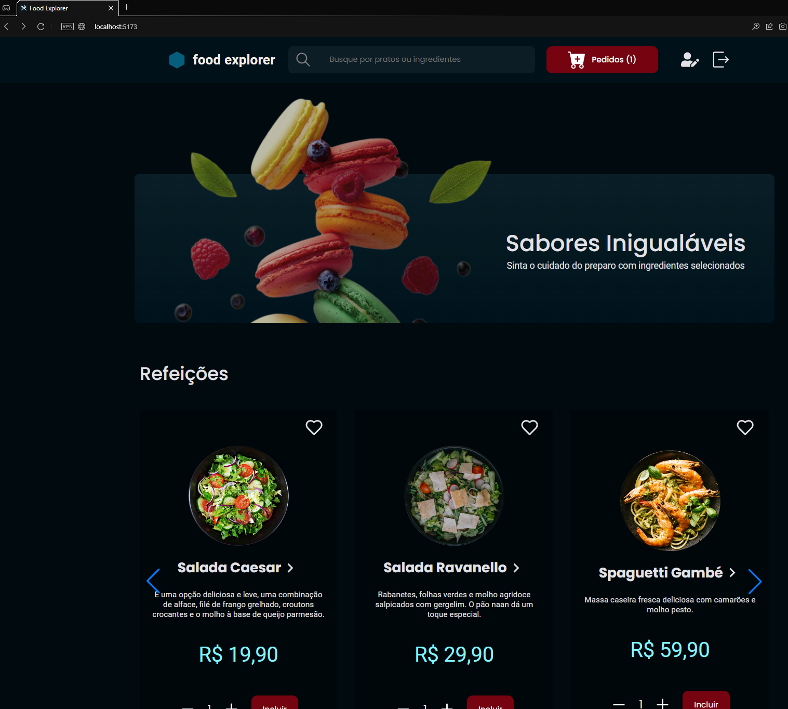
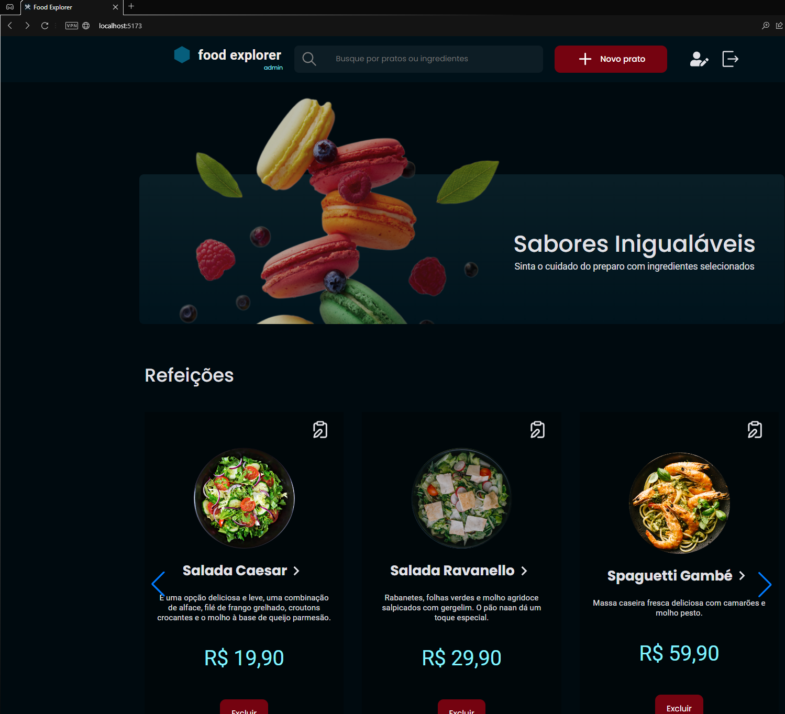

<p align="center">
  
</p

<p align="center">
  
</p>

O FoodExplorer é uma aplicação fullstack, utilizando as tecnologias aprendidas durante o curso Explorer, simulando um restaurante fictício de acordo com o layout disponibilizado no Figma.

O food explorer possui duas personas: o admin e o usuário;

O admin é a pessoa responsável pelo restaurante e tem o acesso para criar, visualizar, editar, apagar um prato e alterar os status de pedidos a qualquer momento. Cada prato deve conter uma imagem, nome, categoria, descrição, ingredientes e o seu preço. Ao clicar em adicionar ou editar prato será redirecionado para a página e ao finalizar receberá uma mensagem de sucesso e será redirecionado para a página principal.

O usuário irá visualizar todos os pratos cadastrados, adicionar ao carrinho, fazer um pedido, adicionar aos favoritos, acompanhar seu histórico de pedidos, atualizar seu perfil e quando clicar em um prato, será redirecionado para uma nova tela com informações mais detalhadas sobre ele.
<br/>

<a target="_blank">[Link para o deploy da aplicação](https://explorer-food-delivery.vercel.app) </a> <br/>
<a target="_blank">[Link para Back-End](https://github.com/larinhab/FoodExplorer_Back) </a>

<br/>
<br/>

<h1 align="center">💻 Instalação</h1>

### **_Pré-requisitos_**

Antes de começar, você vai precisar ter instalado em sua máquina <a target="_blank">[NodeJs](https://nodejs.org/en) </a>, uma ferramenta de versionamento como o <a target="_blank">[GIT](https://git-scm.com/) </a>.
Além disto é recomendado um editor de código, por exemplo o<a target="_blank">[VSCode](https://code.visualstudio.com/) </a>.

### **_Configuração_**

Siga os seguintes passos para configurar e rodar a aplicação localmente:

- Clone o repositório:

  ```bash
    git clone https://github.com/larinhab/FoodExplorer_Back
  ```

- Entre no diretório e instale as dependências:

  ```bash
    npm install
  ```

- Preencha as variáveis seguindo o .env.exemplo:

  ```bash
  VITE_BASE_URL=http://localhost:2008
  ```

- Rode o servidor local:

  ```bash
    npm run dev
  ```

- Caso não ocorra nenhum erro a seguinte mensagem será apresentada:

  ```bash
    VITE v5.1.1  ready in 215 ms

  ➜  Local:   http://localhost:5173
  ```

- Para utilizar todo dos recursos acesse o localhost indicado pelo VITE:

  `http://localhost:5173`
  <br/>
  <br/>

<h1 align="center">🔧 Recursos</h1>

A aplicação possui duas formas de usúario:

- Cliente:
    Acesse com as credencias: testecliente@gmail.com
    Senha: '123456'

  - Mostrar todos os pratos
  - Mostrar um prato especifico
  - Pesquisar por um prato ou ingrediente
  - Adicionar ao carrinho os pedidos
  - Fazer um pedido
  - Adicionar prato aos favoritos
  - Acessar todos os favoritos
  - Acessar página de pagamento
  - Acessar status do pedido
  - Atualizar informações de login
    <br/>
    <br/>

- Administrador:
    Acesse com as credencias: testeadmin@gmail.com
    Senha: '654321'

  - Mostrar todos os pratos
  - Mostrar um prato especifico
  - Pesquisar por um prato ou ingrediente
  - Acessar todos os pedidos
  - Acessar status do pedido
  - Atualizar status de pedidos
  - Atualizar informações da conta
  - Acessar página com informações sobre o restaurante
  - Cadastrar um novo prato
  - Atualizar um prato
  - Deletar um prato
    <br/>
    <br/>

<h1 align="center">📑 Funcionamento</h1>

###### _O render possui um sistema que deixa o servidor hibernando então no primeiro acesso é normal ocorrer um delay na resposta que pode durar até 1 minuto, caso ocorra aguarde essa duração que logo após o funcionamento volta ao normal._

<br/>

- ### **Fazer login**

  Assim que acessar a aplicação a tela para fazer login será apresentada com a opção de criação de conta para o primeiro acesso. Se todos os dados estiverem corretos é liberado o acesso.
  <br/>
  <br/>

- ### **Usuário**

  Dentro da aplicação o usuário tem os seguintes acessos:

  -`/` Página Home que é apresentada após o login.

  -`/plates/:id` Página para visualização de um prato em detalhes, clicando no card que se encontra na Página inicial.

  -`/profile` Página Acessada por um botão localizado no `Header` que permite o usuário alterar os dados de sua conta.

  -`/favorites` Página Acessada por um botão localizado no `Header` que exibe todos os pratos adicionados aos favoritos.

  -`/cart` Página Acessada por um botão localizado no `Header` que exibe os pratos adicionados no carrinho.

  -`/payment` Página Acessada por um botão localizado na página de carrinho que gera uma solicitação e permite o usuário selecionar a forma de pagamento.

  <br/>

- ### **Administrador**

  Além das páginas disponíveis para os usuários o administrador tem acesso a rotas especificas:

  -`/newplate` Página Acessada por um botão localizado no `Header`
  que permite adicionar um novo prato.

  -`/editplate/:id` Página Acessada por um botão localizado no card do prato ná página Home.

  <br/>
  <br/>

<h1 align="center">🗂️ Requisitos</h1>

- ✅ O usuário pode marcar um prato como favorito, basta clicar no coração que aparece em cada prato.
- ✅ O usuário pode excluir um prato do carrinho e o valor total do pedido é atualizado automaticamente.
- ✅ Ao clicar no botão meu pagamento, o usuário é redirecionado para uma tela onde irá ver o seu pedido, a soma e os métodos de pagamento.
- ✅ O usuário pode incluir itens no carrinho, clicando no botão incluir. Já a quantidade é controlada pelos botões “-” e “+”.
- ✅ Um projeto estruturado, com uma boa organização das pastas, e boa divisão dos componentes.
- ✅ Funções, variáveis, classes, arquivos, tabelas e todos os outros elementos do código tem nomes significativos, de acordo com as boas práticas no mercado.
- ✅ Aplicação é responsiva, de acordo com o conceito Mobile First seguindo o modelo do Figma;

  <br/>
  <br/>

<h1 align="center">📊 Tecnologias e Licença</h1>

<p align="center"> 
- React: - React-swiper - React-icons - React router dom - React-lottie - React-Router-Dom 
- Vite 
- Styled-components  
- Axios
- Javascript</p>
<br/>

<p align="center"> Uso de Licença MIT: Essa licença permite o uso, modificação e distribuição do software sem restrições. </p>
<br/>

<p align="center">Feito com ❤️ por Lara 👋🏽 <a href="https://www.linkedin.com/in/lara-barbosa-viana-813428230/">Entre em Contato</a></p>